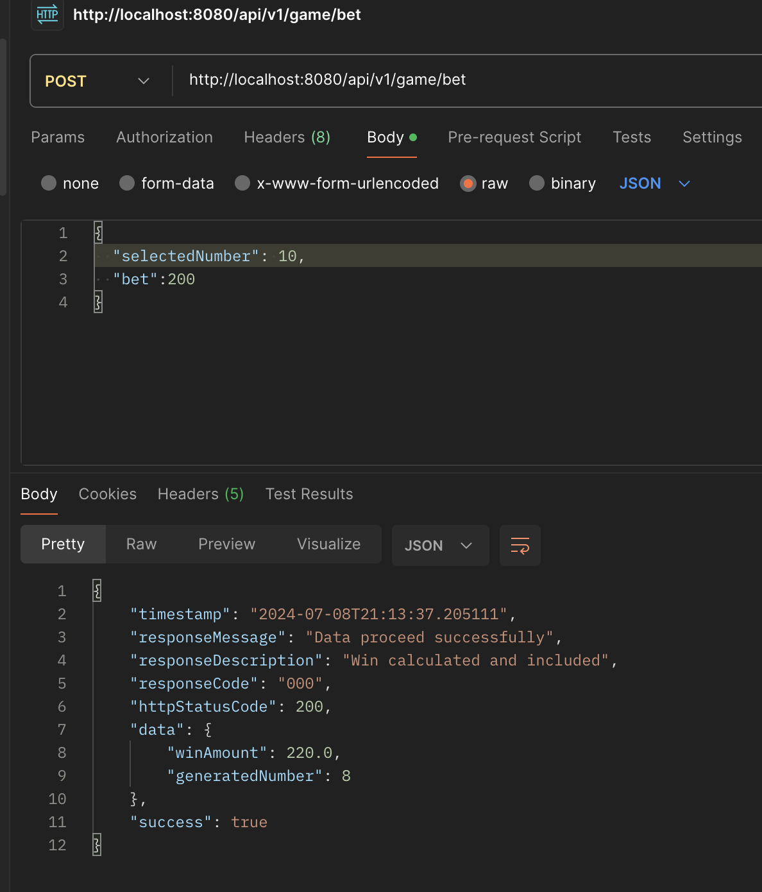
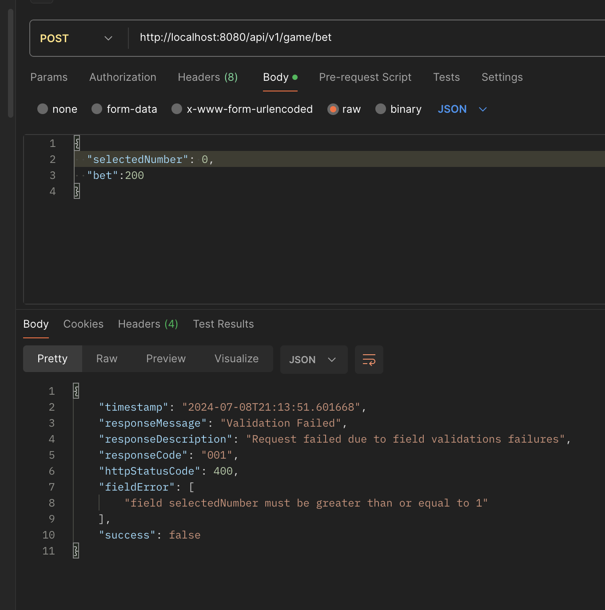

# yolo-test-game-backend - A Simple game backend

## Overview

This project implements the backend for a simple game where players can place bets and choose a number between 1 and 100. The server generates a random number between 1 and 100, and if the player's chosen number is greater than the server's number, the player wins. The amount won is calculated based on the player's bet and the chosen number.

## Tech Stack
Java 11 , Spring boot 2 ,  REST + JSON ,  Unit and Integration tests

Access URL and endpoint - http://localhost:8080/api/v1/game/bet

## Some of Screenshots related to testing

Unit tessting
[](backend-unit_test.png)


API Testing - having a win


API Testing - no win


API Testing - validation failures


## Sample Request 

```json
{
  "selectedNumber": 0,
  "bet":200
}
```

## Sample Response
```json
{
    "timestamp": "2024-07-08T21:21:11.445993",
    "responseMessage": "Data proceed successfully",
    "responseDescription": "Win calculated and included",
    "responseCode": "000",
    "httpStatusCode": 200,
    "data": {
        "winAmount": 220.0,
        "generatedNumber": 6
    },
    "success": true
}
```
